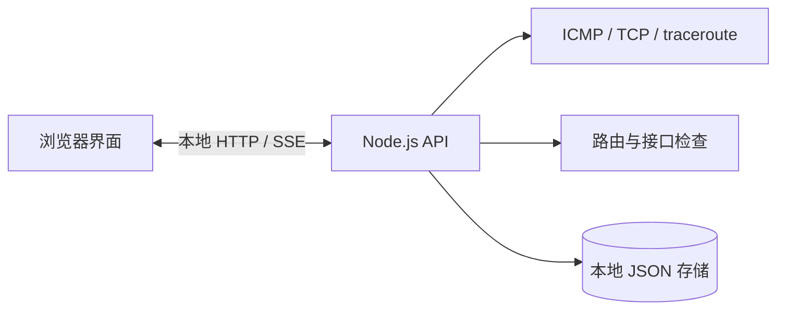

# Delay Monitor

一个本地优先的网络延迟监测器，用来定位「本地链路正常、上游链路偶发抖动」这类难以复现的问题。探测和数据存储都在本机完成，不上传监测数据，也不依赖第三方观测服务。

[](https://github.com/Sen-Yao/delay-monitor/actions/workflows/ci.yml)
[](LICENSE)

English documentation is available below the Chinese documentation. 中文是默认阅读入口。


## 功能

- 使用 ICMP 或 TCP 探测可配置目标，并通过浏览器实时显示最新结果。
- 基于滚动基线识别高延迟、抖动、丢包和超时。
- 将会话和 traceroute 结果保存在本地 JSON 文件，方便事后比较。
- 报告默认路由及可能影响测量的 TUN/代理接口。
- 运行数据留在运行监测器的机器上，没有分析上报接口或托管后端。



## 快速开始

要求：Node.js 22.12 或更高版本，以及 npm。当前原生探测实现面向 macOS；Linux 和 Windows 需要适配命令路径、参数和输出解析。CI 在 Linux 上验证构建与单元测试，不执行真实网络探测。

```bash
git clone https://github.com/Sen-Yao/delay-monitor.git
cd delay-monitor
npm ci
npm run dev
```

打开 <http://127.0.0.1:5173>，API 监听 <http://127.0.0.1:8787>。

生产模式本地运行：

```bash
npm run build
NODE_ENV=production npm run preview
```

服务器第一次启动时会创建 `data/`。该目录被 Git 忽略，因为里面可能有私人地址、路由信息和大量样本。请在「目标」页面配置探测目标，或先停止服务器再编辑本地 JSON 文件。

## 公开结果与演示数据

[`examples/public-results/summary.json`](examples/public-results/summary.json) 是按匿名目标聚合并四舍五入后的公开结果。它保留延迟信号的形状，但不包含原始样本、端点地址、设备名、SSID、会话 ID 或本地时间戳。生成规则和统计限制见 [`examples/public-results/README.md`](examples/public-results/README.md)。

`examples/demo-data/` 提供只使用回环地址的微型演示数据，可用于截图或手动体验界面。它们是演示端点，不是性能基准。

历史外部目标组的 p95 高于两个本地目标组，这正是本工具希望帮助发现的尾延迟差异。由于采集期间目标地址曾变化，聚合结果不能指向固定跳点或证明根因；它只描述一组本地测量，不代表任何运营商或游戏服务的基准。

## 命令

| 命令 | 用途 |
| --- | --- |
| `npm run dev` | 启动 API 和 Vite 开发服务器。 |
| `npm run build` | 检查服务端类型并构建浏览器包。 |
| `npm run preview` | 在本地提供生产构建。 |
| `npm test` | 运行 Vitest 测试。 |
| `npm run typecheck` | 在不生成文件的情况下检查客户端和服务端 TypeScript。 |

## 项目结构

```text
server/                  探测、采样、异常检测和 JSON 存储
src/                     React 界面与共享 TypeScript 类型
examples/public-results/ 可公开的匿名聚合结果
examples/demo-data/      截图和 UI 演示用回环地址样例
docs/                    公开使用说明和平台备注
```

## 测量说明

检测器只根据近期样本工作，刻意不直接宣称根因。高延迟事件表示观测目标越过了滚动阈值，不证明该目标造成了问题。请对比多个目标、多个会话和路径结果后再下结论。

当前实现使用 `/sbin/ping`、`/usr/sbin/traceroute`、`/usr/sbin/netstat` 和 `/sbin/ifconfig`，并采用 macOS 参数。Linux 和 Windows 用户需要适配这些命令分支；[`docs/platform-notes.md`](docs/platform-notes.md) 记录了相关差异。

## 隐私与安全

目标由用户提供，可能暴露私人网络。分享前请检查生成文件。不要提交密码、Wi-Fi 密钥、路由器会话值、Cookie、私人 IP 地址或未脱敏的 traceroute。公开仓库默认不会跟踪实时运行数据。

这是一个没有身份验证的本地诊断工具，请保持它绑定在 loopback，不要通过端口转发或公共隧道暴露。采样会在启动时自动开始，原始样本文件也会持续增长且没有轮转；分享前请先停止服务并检查 `data/`。

## 贡献

欢迎提交 Bug、解析器样例、平台支持和文档改进。提交 Issue 或 Pull Request 前请阅读 [`CONTRIBUTING.md`](CONTRIBUTING.md)。

## 许可证

本项目采用 [MIT License](LICENSE) 发布。

<details>
<summary>English documentation</summary>

## Overview

Delay Monitor is a local-first network latency monitor for investigating intermittent spikes such as a stable local link followed by a noisy upstream path. Probes and storage stay on the machine running the monitor; there is no telemetry endpoint or hosted backend.


### Features

- Poll configurable targets with ICMP or TCP probes and stream the latest values to the browser.
- Detect high latency, jitter, packet loss, and timeouts against a rolling baseline.
- Store sessions and traceroute results in local JSON files for later comparison.
- Report the default route and possible TUN/proxy interfaces that can affect measurements.
- Keep runtime output local with no analytics service.

### Quick start

Requirements: Node.js 22.12+ and npm. Native probing currently targets macOS; Linux and Windows need command, argument, and parser adaptations. Linux CI verifies the build and unit tests without running live network probes.

```bash
git clone https://github.com/Sen-Yao/delay-monitor.git
cd delay-monitor
npm ci
npm run dev
```

Open <http://127.0.0.1:5173>. The API listens on <http://127.0.0.1:8787>.

For a production-style local run:

```bash
npm run build
NODE_ENV=production npm run preview
```

The server creates `data/` on first start. Git ignores this directory because it can contain private addresses, route information, and high-volume samples. Configure targets from the **目标** view or edit local JSON files after stopping the server.

### Public results and demo data

[`examples/public-results/summary.json`](examples/public-results/summary.json) is an anonymized and rounded aggregate. It preserves the shape of the latency signal without publishing raw samples, endpoint addresses, device names, SSIDs, session IDs, or wall-clock timestamps. See [`examples/public-results/README.md`](examples/public-results/README.md) for the method and limitations.

`examples/demo-data/` contains a tiny loopback-only fixture for screenshots and manual UI demos. These are demo endpoints, not a benchmark.

The historical external-target group has a higher p95 than the two local-target groups. Addresses changed during collection, so the aggregate cannot identify a fixed hop or establish root cause; it describes one local measurement set rather than any provider or game-service benchmark.

### Commands

| Command | Purpose |
| --- | --- |
| `npm run dev` | Start the API and Vite development server. |
| `npm run build` | Type-check the server and build the browser bundle. |
| `npm run preview` | Serve the production bundle locally. |
| `npm test` | Run the Vitest suite. |
| `npm run typecheck` | Run client and server TypeScript checks without emitting files. |

### Measurement and platform notes

The detector works from recent samples and deliberately avoids claiming root cause. A high-latency incident means that the observed target crossed a rolling threshold; it does not prove that target caused the problem. Compare multiple targets, sessions, and routes before drawing a conclusion.

The implementation currently calls `/sbin/ping`, `/usr/sbin/traceroute`, `/usr/sbin/netstat`, and `/sbin/ifconfig` with macOS arguments. Linux and Windows users need to adapt these command branches; [`docs/platform-notes.md`](docs/platform-notes.md) records the differences.

### Privacy and security

Targets are user supplied and may identify a private network. Review generated files before sharing them. Do not commit passwords, Wi-Fi keys, router session values, cookies, private IP addresses, or unredacted traceroutes. Keep this unauthenticated diagnostic tool bound to loopback; do not expose it through port forwarding or a public tunnel. Sampling starts automatically and raw sample storage grows without rotation.

### Contributing and license

Bug reports, parser fixtures, platform support, and documentation improvements are welcome. Read [`CONTRIBUTING.md`](CONTRIBUTING.md) before opening an issue or pull request. The project is released under the [MIT License](LICENSE).

</details>
