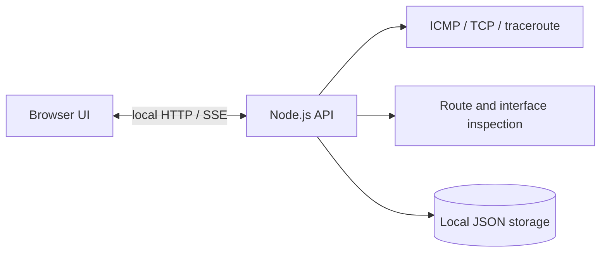

# Delay Monitor

一个本地优先的网络延迟监测器，用来定位「本地链路正常、上游链路偶发抖动」这类难以复现的问题。它在本机运行探测和数据存储，不上传监测数据，也不依赖第三方观测服务。

[](https://github.com/Sen-Yao/delay-monitor/actions/workflows/ci.yml)
[](LICENSE)

> The interface is currently Chinese-first. The code and public documentation are intentionally compact so the project can be used as a starting point for local network diagnostics.

## What it does

- Polls configurable targets with ICMP or TCP probes and streams the latest results to the browser.
- Detects high latency, jitter, packet loss, and timeouts against a rolling baseline.
- Records sessions and traceroute results in local JSON files for later comparison.
- Reports the default route and possible TUN/proxy interfaces that can affect measurements.
- Keeps runtime data on the machine running the monitor. There is no analytics endpoint or hosted backend.



## Quick start

Requirements: Node.js 20 or newer and npm. ICMP and traceroute support depends on the host operating system; the current probe paths target macOS and Linux.

```bash
git clone https://github.com/Sen-Yao/delay-monitor.git
cd delay-monitor
npm ci
npm run dev
```

Open <http://127.0.0.1:5173>. The API listens on <http://127.0.0.1:8787>.

For a production-style local run:

```bash
npm run build
NODE_ENV=production npm run preview
```

The monitor creates `data/` on first start. That directory is intentionally ignored by Git because it can contain private addresses, route information, and high-volume samples. Configure targets from the **目标** view or edit the local JSON files after stopping the server.

## Public example results

The repository includes an aggregated, anonymized result in [`examples/public-results/summary.json`](examples/public-results/summary.json). It preserves the shape of the signal without publishing raw samples, endpoint addresses, device names, SSIDs, session IDs, or local timestamps. The accompanying [notes](examples/public-results/README.md) explain the method and limits of the summary.

The example shows the kind of pattern this tool is designed to surface: a near-gateway target can remain comparatively stable while an upstream or public target develops a much larger tail. These observations describe one local measurement set; they are not a guarantee about any ISP, game service, or network topology.

## Commands

| Command | Purpose |
| --- | --- |
| `npm run dev` | Start the API and Vite development server. |
| `npm run build` | Type-check the server and build the browser bundle. |
| `npm run preview` | Serve the production bundle locally. |
| `npm test` | Run the Vitest suite. |
| `npm run typecheck` | Run client and server TypeScript checks without emitting files. |

## Project layout

```text
server/                 Probe, sampling, incident detection, and JSON storage
src/                    React UI and shared TypeScript types
examples/public-results/ Anonymized aggregate output suitable for publication
docs/                   Public usage and design notes
```

## Measurement notes

The detector is deliberately conservative and works from recent samples rather than claiming root cause. A high-latency incident means that the observed target crossed the configured rolling threshold; it does not prove that target caused the problem. Compare multiple targets, sessions, and routes before drawing a conclusion.

The current implementation calls `/sbin/ping`, `/usr/sbin/traceroute`, `/usr/sbin/netstat`, and `/sbin/ifconfig`. Windows users can run the UI and server after adapting those command branches; [`docs/platform-notes.md`](docs/platform-notes.md) records the expected native commands.

## Privacy and responsible use

Targets are user supplied and may identify a private network. Review generated files before sharing them. Do not commit passwords, Wi-Fi keys, router session values, cookies, private IP addresses, or unredacted traceroutes. The public repository keeps live runtime output out of version control by default.

## Contributing

Bug reports, parser fixtures, platform support, and documentation improvements are welcome. Please read [`CONTRIBUTING.md`](CONTRIBUTING.md) before opening an issue or pull request.

## License

Released under the [MIT License](LICENSE).
