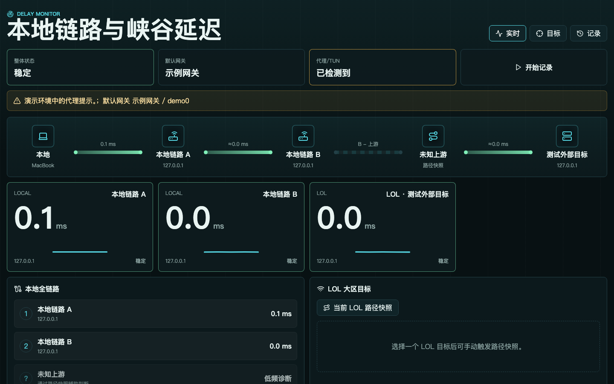

# Delay Monitor

看清延迟从哪里开始变高。

[](https://github.com/Sen-Yao/delay-monitor/actions/workflows/ci.yml)
[](LICENSE)

中文 · [English](#english)

打游戏突然卡一下，网页偶尔转圈，却又很难在事后复现？Delay Monitor 会同时观察本地路由器、上游网关和公网目标，把延迟曲线、丢包和异常片段放在一起，方便对照。

它是一个跑在本机的小工具：浏览器看面板，Node.js 做探测，记录保存在本地文件里。无需账号，也不用接入监控平台。



<sub>截图使用回环地址演示数据，网关与接口信息已替换为示例值。</sub>

## 能做什么

- **一起看几段链路**：同时观察多个目标的延迟，支持 ICMP 和 TCP 探测。
- **留下卡顿时的线索**：记录高延迟、抖动、丢包、超时和前后样本。
- **按会话回看**：开始一次记录，结束后查看这段时间的统计。
- **补一张路径快照**：手动运行 traceroute，结合默认路由和代理/TUN 提示排查。

界面目前以中文为主，保留了 LOL 大区目标配置，普通网络目标也可以使用。

## 跑起来

需要 **macOS、Node.js 22.12+ 和 npm**。Linux / Windows 的原生探测还需要适配，见 [平台说明](docs/platform-notes.md)。

```bash
git clone https://github.com/Sen-Yao/delay-monitor.git
cd delay-monitor
npm ci
npm run dev
```

打开 **<http://127.0.0.1:5173>**，到「目标」页面填入自己的地址。API 默认运行在 `127.0.0.1:8787`。

启动后会自动采样。默认配置里的两个私网地址只是常见示例，记得按自己的网络修改。

想运行构建后的版本：

```bash
npm run build
npm run preview
```

然后打开 <http://127.0.0.1:8787>。

## 怎么看结果

先选几个有对照意义的目标，例如本地路由器、上游网关和一个公网地址，观察它们是否在同一时间出现尖峰。如果只有某个目标异常，再结合路径快照进一步排查。

面板给的是排查线索：ICMP 超时不一定代表业务断网，图里的相邻目标延迟差也不等于精确的逐跳耗时。目标顺序需要自己确认，工具不会自动发现完整拓扑。

仓库里放了两份样例：

- [脱敏统计](examples/public-results/)：来自历史采样，附统计口径和限制。
- [演示数据](examples/demo-data/)：回环地址和预设事件，用于体验界面，不代表真实网络表现。

## 记录存在哪

首次启动会创建 `data/`，配置、采样、异常事件和路径记录都在这里。这个目录不进 Git，也不会被应用上传。

`samples.jsonl` 会持续增长，目前没有自动清理。备份或整理数据前先停服务；分享记录时，注意里面可能有真实地址和路由信息。

服务只适合本机使用，没有登录验证，请不要通过端口转发或公共隧道暴露到外网。

## 开发

React + TypeScript + Vite，后端使用 Node.js。界面在 `src/`，探测、采样和存储在 `server/`，两端共用 `src/shared/types.ts`。

```bash
npm test             # 单元测试
npm run typecheck    # 类型检查
npm run build        # 构建
```

目前原生命令和参数按 macOS 实现。Linux CI 通过表示测试与构建通过，不代表已支持 Linux 网络探测。

欢迎带着问题、解析器样例或平台适配来提 [Issue](https://github.com/Sen-Yao/delay-monitor/issues) / PR。提交前可参考 [贡献指南](CONTRIBUTING.md)，日志和截图请先脱敏。

## License

[MIT](LICENSE) © Sen-Yao

---

<a id="english"></a>
<details>
<summary>English</summary>

## Delay Monitor

Compare latency across your local network and beyond.

Delay Monitor puts several targets on one dashboard so you can compare their latency spikes, packet loss, and incident history. It runs on your own machine: a browser dashboard, a Node.js probe server, and local files for storage. No account or monitoring service required.

The interface is currently Chinese. It includes a configurable LOL target alongside local network targets.

### Features

- Watch multiple targets with ICMP or TCP probes.
- Keep high-latency, jitter, packet-loss, and timeout events with surrounding samples.
- Record sessions and review their statistics.
- Run traceroute on demand and inspect default-route and TUN/proxy hints.

### Get started

Requires **macOS, Node.js 22.12+, and npm**. Native probing on Linux and Windows still needs adaptation; see [platform notes](docs/platform-notes.md).

```bash
git clone https://github.com/Sen-Yao/delay-monitor.git
cd delay-monitor
npm ci
npm run dev
```

Open **<http://127.0.0.1:5173>** and configure your addresses in the **目标** (Targets) tab. The API runs on `127.0.0.1:8787`.

Sampling starts automatically. The two default private addresses are examples; change them to match your network.

To run the built version:

```bash
npm run build
npm run preview
```

Then open <http://127.0.0.1:8787>.

### Reading the dashboard

Compare targets such as a local router, an upstream gateway, and a public endpoint. Look for spikes at the same time, then use a route snapshot to investigate further.

Treat the dashboard as evidence for troubleshooting. An ICMP timeout does not necessarily mean application traffic failed, and differences between target RTTs are not exact per-hop delays. You must confirm the target order yourself; the tool does not discover a complete topology.

The repository includes [anonymized historical statistics](examples/public-results/) and [loopback demo fixtures](examples/demo-data/). The screenshot above uses demo targets with gateway and interface details replaced by placeholders; it is not a performance benchmark.

### Data and local access

Configuration, samples, incidents, sessions, and route snapshots live in `data/`. Git ignores this directory and the application does not upload it. `samples.jsonl` grows without automatic rotation, so stop the server before backing up or cleaning it. Redact addresses and route details before sharing records.

There is no authentication. Keep the service on loopback and do not expose it through a public tunnel or port forwarding.

### Development

React, TypeScript, and Vite power the UI in `src/`. The Node.js backend lives in `server/`; shared types are in `src/shared/types.ts`.

```bash
npm test
npm run typecheck
npm run build
```

Native command paths and arguments currently target macOS. Linux CI covers unit tests and builds, not live probes.

Issues, parser fixtures, and platform contributions are welcome. See [CONTRIBUTING.md](CONTRIBUTING.md) and redact logs or screenshots before posting.

[MIT](LICENSE) © Sen-Yao

</details>
